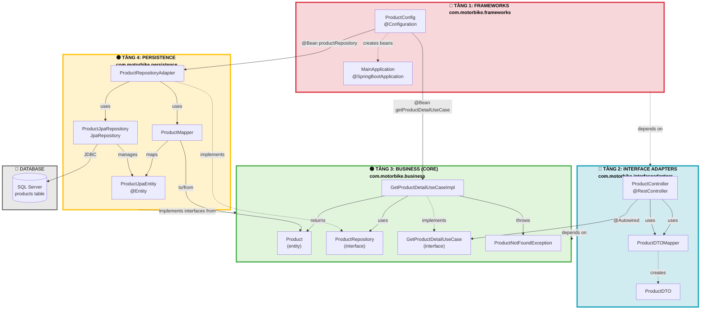
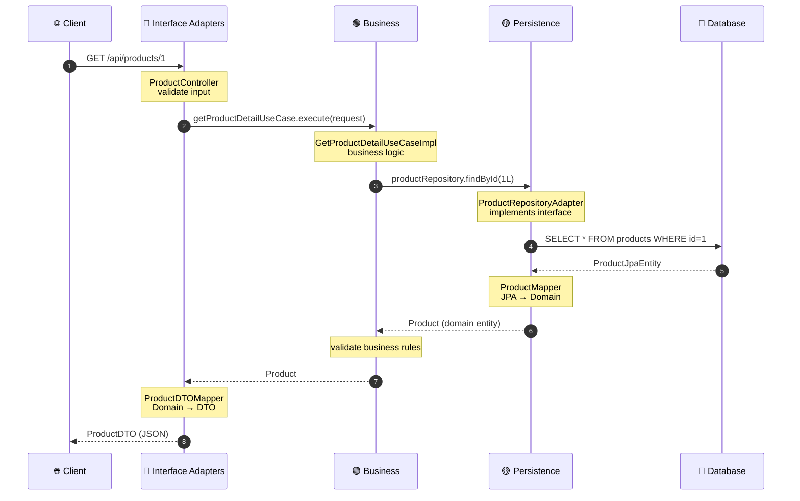
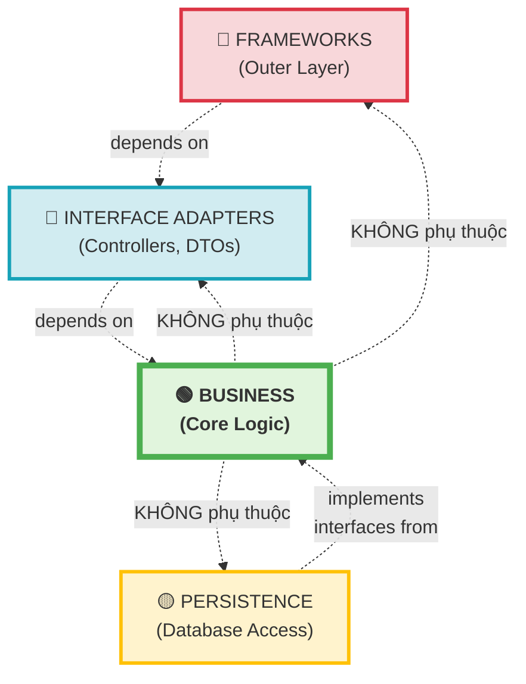

# Use Case 1: Xem Chi Tiết Sản Phẩm - Luồng 4 Tầng Clean Architecture

## 🏗️ Sơ Đồ 4 Tầng (4-Layer Architecture)



---

## 📦 Chi Tiết 4 Tầng (Package Structure)

### 🔴 **TẦNG 1: FRAMEWORKS** 
**Package:** `com.motorbike.frameworks.config`

```
frameworks/
└── config/
    ├── ProductConfig.java          ← Spring Bean Configuration
    ├── CartConfig.java
    ├── OrderConfig.java
    └── AuthConfig.java

main/
└── MainApplication.java            ← Spring Boot Entry Point
```

**Trách nhiệm:**
- Khởi tạo Spring Boot application
- Cấu hình Spring Beans
- Dependency Injection wiring
- Kết nối các tầng với nhau

**Code mẫu:**
```java
@Configuration
public class ProductConfig {
    
    @Bean
    public ProductRepository productRepository(ProductJpaRepository jpaRepo) {
        return new ProductRepositoryAdapter(jpaRepo);
    }
    
    @Bean
    public GetProductDetailUseCase getProductDetailUseCase(ProductRepository repo) {
        return new GetProductDetailUseCaseImpl(repo);
    }
}
```

---

### 🔵 **TẦNG 2: INTERFACE ADAPTERS**
**Package:** `com.motorbike.interfaceadapters`

```
interfaceadapters/
├── controller/
│   ├── ProductController.java      ← REST API Endpoints
│   ├── CartController.java
│   ├── OrderController.java
│   └── AuthController.java
├── dto/
│   ├── ProductDTO.java             ← Data Transfer Objects
│   ├── CartDTO.java
│   ├── OrderDTO.java
│   └── UserDTO.java
└── mapper/
    ├── ProductDTOMapper.java       ← Domain ↔ DTO Conversion
    ├── CartDTOMapper.java
    └── OrderDTOMapper.java
```

**Trách nhiệm:**
- Xử lý HTTP requests/responses
- Convert giữa Domain entities và DTOs
- Input validation
- Error handling và response formatting

**Luồng trong tầng:**
```
HTTP Request → Controller → DTOMapper → DTO
                  ↓
          Use Case (Business Layer)
                  ↓
Domain Entity → DTOMapper → DTO → HTTP Response
```

**Code mẫu:**
```java
@RestController
@RequestMapping("/api/products")
public class ProductController {
    
    private final GetProductDetailUseCase getProductDetailUseCase;
    
    @GetMapping("/{id}")
    public ResponseEntity<?> getProductById(@PathVariable Long id) {
        // 1. Validate input
        // 2. Call Use Case
        // 3. Convert Domain → DTO
        // 4. Return HTTP Response
    }
}
```

---

### 🟢 **TẦNG 3: BUSINESS (CORE LOGIC)**
**Package:** `com.motorbike.business`

```
business/
├── entity/
│   ├── Product.java                ← Domain Entities
│   ├── Cart.java
│   ├── Order.java
│   └── User.java
├── repository/
│   ├── ProductRepository.java      ← Repository Interfaces
│   ├── CartRepository.java
│   ├── OrderRepository.java
│   └── UserRepository.java
├── usecase/
│   ├── GetProductDetailUseCase.java    ← Use Case Interfaces
│   ├── AddToCartUseCase.java
│   └── CheckoutUseCase.java
├── usecase/impl/
│   ├── GetProductDetailUseCaseImpl.java  ← Business Logic
│   ├── AddToCartUseCaseImpl.java
│   └── CheckoutUseCaseImpl.java
└── exception/
    ├── ProductNotFoundException.java
    ├── EmptyCartException.java
    └── InsufficientStockException.java
```

**Trách nhiệm:**
- **Core business logic** (quan trọng nhất!)
- Domain entities với business rules
- Use Cases orchestration
- Repository interfaces (không có implementation!)
- Custom exceptions

**Nguyên tắc:**
- ❌ **KHÔNG** phụ thuộc vào database
- ❌ **KHÔNG** phụ thuộc vào UI/framework
- ✅ **CHỈ** chứa business logic thuần túy
- ✅ Định nghĩa interfaces cho data access

**Code mẫu:**
```java
// Domain Entity
public class Product {
    private Long id;
    private String name;
    private BigDecimal price;
    
    // Business logic methods
    public boolean isAvailable() {
        return stockQuantity > 0;
    }
    
    public void validate() {
        if (price.compareTo(BigDecimal.ZERO) <= 0) {
            throw new IllegalArgumentException("Price must be positive");
        }
    }
}

// Repository Interface (không có implementation)
public interface ProductRepository {
    Optional<Product> findById(Long id);
    List<Product> findAll();
    Product save(Product product);
}

// Use Case Implementation
public class GetProductDetailUseCaseImpl implements GetProductDetailUseCase {
    private final ProductRepository repository; // Interface!
    
    @Override
    public GetProductDetailResponse execute(GetProductDetailRequest request) {
        // Business logic here
        validateRequest(request);
        Optional<Product> product = repository.findById(request.getProductId());
        // ...
    }
}
```

---

### 🟡 **TẦNG 4: PERSISTENCE**
**Package:** `com.motorbike.persistence`

```
persistence/
├── entity/
│   ├── ProductJpaEntity.java       ← JPA Entities (@Entity)
│   ├── CartJpaEntity.java
│   ├── OrderJpaEntity.java
│   └── UserJpaEntity.java
├── repository/
│   ├── ProductJpaRepository.java   ← Spring Data JPA Repos
│   ├── CartJpaRepository.java
│   ├── OrderJpaRepository.java
│   └── UserJpaRepository.java
├── mapper/
│   ├── ProductMapper.java          ← JPA ↔ Domain Conversion
│   ├── CartMapper.java
│   ├── OrderMapper.java
│   └── UserMapper.java
└── adapter/
    ├── ProductRepositoryAdapter.java   ← Implement Business Interfaces
    ├── CartRepositoryAdapter.java
    ├── OrderRepositoryAdapter.java
    └── UserRepositoryAdapter.java
```

**Trách nhiệm:**
- **Implement** repository interfaces từ Business Layer
- JPA entities cho database mapping
- Spring Data JPA repositories
- Mapper convert giữa JPA entities và Domain entities
- Database access logic

**Luồng trong tầng:**
```
Business Layer (ProductRepository interface)
         ↓ implements
ProductRepositoryAdapter
         ↓ uses
ProductJpaRepository (Spring Data JPA)
         ↓ query
ProductJpaEntity (@Entity)
         ↓ map to
Product (Domain Entity)
```

**Code mẫu:**
```java
// JPA Entity
@Entity
@Table(name = "products")
public class ProductJpaEntity {
    @Id
    @GeneratedValue(strategy = GenerationType.IDENTITY)
    private Long id;
    
    private String name;
    private BigDecimal price;
    // ... database columns
}

// Spring Data JPA Repository
public interface ProductJpaRepository extends JpaRepository<ProductJpaEntity, Long> {
    List<ProductJpaEntity> findByCategory(String category);
}

// Mapper
public class ProductMapper {
    public static Product toDomainEntity(ProductJpaEntity jpaEntity) {
        return Product.builder()
            .id(jpaEntity.getId())
            .name(jpaEntity.getName())
            .price(jpaEntity.getPrice())
            .build();
    }
    
    public static ProductJpaEntity toJpaEntity(Product domain) {
        ProductJpaEntity entity = new ProductJpaEntity();
        entity.setId(domain.getId());
        entity.setName(domain.getName());
        entity.setPrice(domain.getPrice());
        return entity;
    }
}

// Repository Adapter (implements interface từ Business Layer)
public class ProductRepositoryAdapter implements ProductRepository {
    private final ProductJpaRepository jpaRepository;
    
    @Override
    public Optional<Product> findById(Long id) {
        return jpaRepository.findById(id)
            .map(ProductMapper::toDomainEntity);
    }
    
    @Override
    public Product save(Product product) {
        ProductJpaEntity jpaEntity = ProductMapper.toJpaEntity(product);
        ProductJpaEntity saved = jpaRepository.save(jpaEntity);
        return ProductMapper.toDomainEntity(saved);
    }
}
```

---

## 🔄 Luồng Hoạt Động Qua 4 Tầng

### **📥 REQUEST FLOW (Client → Database)**



### **📤 RESPONSE FLOW (Database → Client)**

```
💾 Database
    ↓ SQL Query Result
🟡 ProductJpaEntity (Persistence)
    ↓ ProductMapper.toDomainEntity()
🟢 Product (Business Domain Entity)
    ↓ Business validation
🟢 GetProductDetailUseCaseImpl returns Product
    ↓ ProductDTOMapper.toDTO()
🔵 ProductDTO (Interface Adapters)
    ↓ JSON serialization
🌐 Client receives JSON
```

---

## 🎯 Dependency Rule (Quy Tắc Phụ Thuộc)



### **Nguyên tắc:**
1. ✅ **Outer layers CÓ THỂ phụ thuộc vào Inner layers**
   - Frameworks → Interface Adapters → Business
   
2. ❌ **Inner layers KHÔNG ĐƯỢC phụ thuộc vào Outer layers**
   - Business ❌ → Interface Adapters
   - Business ❌ → Persistence
   - Business ❌ → Frameworks

3. ✅ **Persistence implements interfaces từ Business**
   - ProductRepository (interface) ← Business Layer
   - ProductRepositoryAdapter (implementation) ← Persistence Layer

---

## 📊 So Sánh 4 Tầng

| Tầng | Package | Vai trò | Phụ thuộc | Ví dụ |
|------|---------|---------|-----------|-------|
| 🔴 **Frameworks** | `frameworks`, `main` | Khởi tạo app, cấu hình beans | → Interface Adapters | `ProductConfig`, `MainApplication` |
| 🔵 **Interface Adapters** | `interfaceadapters` | HTTP handling, DTOs | → Business | `ProductController`, `ProductDTO` |
| 🟢 **Business** | `business` | **Core logic**, entities, use cases | ❌ Không phụ thuộc outer layers | `Product`, `GetProductDetailUseCase` |
| 🟡 **Persistence** | `persistence` | Database access, JPA | ← Implements Business interfaces | `ProductJpaEntity`, `ProductRepositoryAdapter` |

---

## 🔑 Lợi Ích Của Kiến Trúc 4 Tầng

### ✅ **1. Tách biệt rõ ràng (Separation of Concerns)**
- Mỗi tầng có trách nhiệm riêng
- Dễ tìm code khi cần sửa
- Không bị lẫn lộn giữa business logic và database code

### ✅ **2. Dễ test (Testability)**
```java
// Test Business Layer - KHÔNG cần database thật
@Test
void testGetProductDetail() {
    // Mock repository
    ProductRepository mockRepo = mock(ProductRepository.class);
    when(mockRepo.findById(1L)).thenReturn(Optional.of(testProduct));
    
    // Test use case với mock
    GetProductDetailUseCaseImpl useCase = new GetProductDetailUseCaseImpl(mockRepo);
    var response = useCase.execute(new GetProductDetailRequest(1L));
    
    assertNotNull(response.getProduct());
}
```

### ✅ **3. Thay đổi dễ dàng (Flexibility)**
- Đổi database (MySQL → PostgreSQL) → Chỉ sửa Persistence Layer
- Đổi UI (REST → GraphQL) → Chỉ sửa Interface Adapters Layer
- Business logic GIỮ NGUYÊN!

### ✅ **4. Mở rộng dễ (Scalability)**
- Thêm use case mới → Tạo class mới trong Business Layer
- Thêm API endpoint → Tạo controller mới trong Interface Adapters
- Không ảnh hưởng code cũ

### ✅ **5. Bảo trì tốt (Maintainability)**
- Code có cấu trúc rõ ràng
- Dễ onboard developer mới
- Bug ít hơn vì tách biệt concerns

---

## 📁 Cấu Trúc Thư Mục Hoàn Chỉnh

```
src/main/java/com/motorbike/
│
├── 🔴 frameworks/
│   └── config/
│       ├── ProductConfig.java
│       ├── CartConfig.java
│       ├── OrderConfig.java
│       └── AuthConfig.java
│
├── 🔵 interfaceadapters/
│   ├── controller/
│   │   ├── ProductController.java
│   │   ├── CartController.java
│   │   ├── OrderController.java
│   │   └── AuthController.java
│   ├── dto/
│   │   ├── ProductDTO.java
│   │   ├── CartDTO.java
│   │   └── OrderDTO.java
│   └── mapper/
│       ├── ProductDTOMapper.java
│       ├── CartDTOMapper.java
│       └── OrderDTOMapper.java
│
├── 🟢 business/
│   ├── entity/
│   │   ├── Product.java
│   │   ├── Cart.java
│   │   ├── Order.java
│   │   └── User.java
│   ├── repository/
│   │   ├── ProductRepository.java (interface)
│   │   ├── CartRepository.java (interface)
│   │   ├── OrderRepository.java (interface)
│   │   └── UserRepository.java (interface)
│   ├── usecase/
│   │   ├── GetProductDetailUseCase.java
│   │   ├── AddToCartUseCase.java
│   │   └── CheckoutUseCase.java
│   ├── usecase/impl/
│   │   ├── GetProductDetailUseCaseImpl.java
│   │   ├── AddToCartUseCaseImpl.java
│   │   └── CheckoutUseCaseImpl.java
│   └── exception/
│       ├── ProductNotFoundException.java
│       └── EmptyCartException.java
│
├── 🟡 persistence/
│   ├── entity/
│   │   ├── ProductJpaEntity.java
│   │   ├── CartJpaEntity.java
│   │   └── OrderJpaEntity.java
│   ├── repository/
│   │   ├── ProductJpaRepository.java
│   │   ├── CartJpaRepository.java
│   │   └── OrderJpaRepository.java
│   ├── mapper/
│   │   ├── ProductMapper.java
│   │   ├── CartMapper.java
│   │   └── OrderMapper.java
│   └── adapter/
│       ├── ProductRepositoryAdapter.java
│       ├── CartRepositoryAdapter.java
│       └── OrderRepositoryAdapter.java
│
└── main/
    └── MainApplication.java
```

---

## 🎓 Kết Luận

**Clean Architecture 4 tầng** giúp:
- 📦 **Tổ chức code rõ ràng** theo packages
- 🔄 **Luồng xử lý logic** dễ hiểu
- 🧪 **Test dễ dàng** với mock/stub
- 🔧 **Thay đổi linh hoạt** không ảnh hưởng business
- 📈 **Mở rộng nhanh** khi thêm features

**Core principle:** Business Logic là trung tâm, không phụ thuộc vào bất kỳ layer nào khác! 🎯
