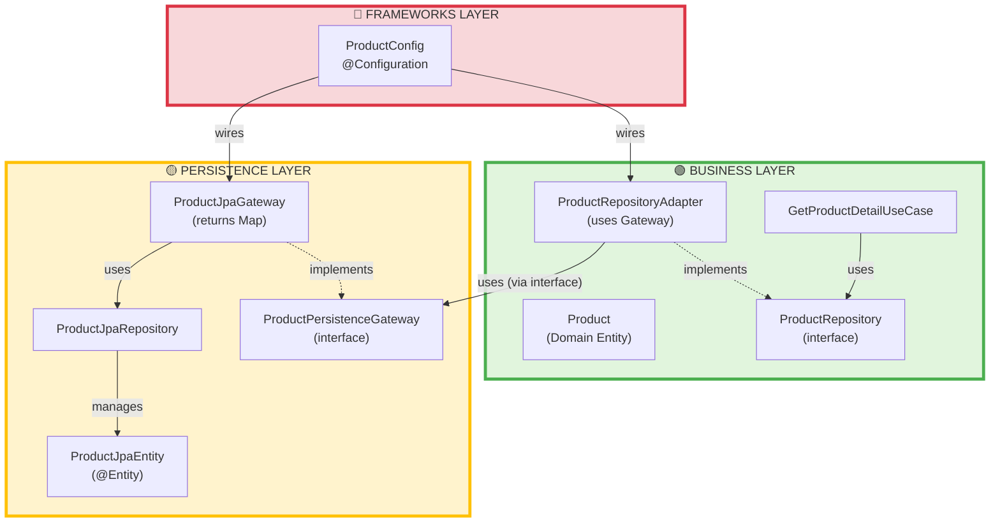
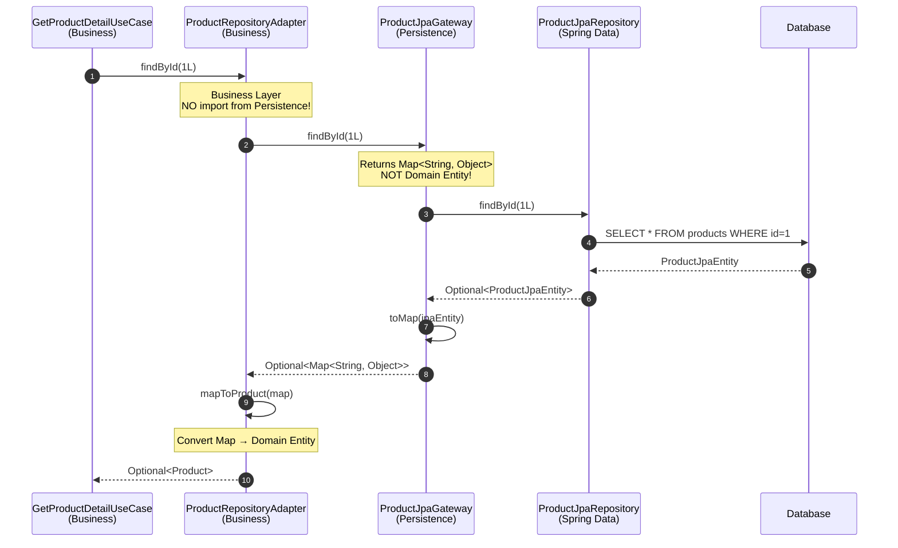

# Clean Architecture với Gateway Pattern - KHÔNG có dependency từ Persistence lên Business

## 🎯 Kiến Trúc Mới



---

## 🔄 Luồng Dữ Liệu (Data Flow)



---

## 📦 Cấu Trúc Package

### ✅ **Business Layer** (KHÔNG import Persistence entities)
```
business/
├── entity/
│   └── Product.java                    ← Domain Entity
├── repository/
│   └── ProductRepository.java          ← Interface
├── adapter/
│   └── ProductRepositoryAdapter.java   ← Uses Gateway interface
├── usecase/
│   ├── GetProductDetailUseCase.java
│   └── impl/
│       └── GetProductDetailUseCaseImpl.java
```

**ProductRepositoryAdapter:**
```java
package com.motorbike.business.adapter;

import com.motorbike.business.entity.Product;
import com.motorbike.business.repository.ProductRepository;
import com.motorbike.persistence.gateway.ProductPersistenceGateway; // ✅ Interface only!

public class ProductRepositoryAdapter implements ProductRepository {
    private final ProductPersistenceGateway gateway;
    
    public Optional<Product> findById(Long id) {
        return gateway.findById(id)
            .map(this::mapToProduct); // Map → Domain Entity
    }
    
    private Product mapToProduct(Map<String, Object> data) {
        // Convert Map to Product
    }
}
```

---

### ✅ **Persistence Layer** (KHÔNG import Business entities)
```
persistence/
├── gateway/
│   ├── ProductPersistenceGateway.java  ← Interface (returns Map)
│   └── ProductJpaGateway.java          ← Implementation
├── entity/
│   └── ProductJpaEntity.java           ← JPA Entity
├── repository/
│   └── ProductJpaRepository.java       ← Spring Data JPA
```

**ProductPersistenceGateway:**
```java
package com.motorbike.persistence.gateway;

public interface ProductPersistenceGateway {
    Optional<Map<String, Object>> findById(Long id); // ✅ Returns Map, NOT Product!
    Map<String, Object> save(Map<String, Object> data);
}
```

**ProductJpaGateway:**
```java
package com.motorbike.persistence.gateway;

import com.motorbike.persistence.entity.ProductJpaEntity; // ✅ OK - same layer
// ❌ NO import from business.entity!

@Component
public class ProductJpaGateway implements ProductPersistenceGateway {
    private final ProductJpaRepository jpaRepository;
    
    public Optional<Map<String, Object>> findById(Long id) {
        return jpaRepository.findById(id)
            .map(this::toMap); // JPA Entity → Map
    }
    
    private Map<String, Object> toMap(ProductJpaEntity entity) {
        Map<String, Object> map = new HashMap<>();
        map.put("id", entity.getId());
        map.put("name", entity.getName());
        // ...
        return map;
    }
}
```

---

### ✅ **Frameworks Layer**
```
frameworks/
└── config/
    └── ProductConfig.java
```

**ProductConfig:**
```java
@Configuration
public class ProductConfig {
    
    @Bean
    public ProductRepository productRepository(ProductPersistenceGateway gateway) {
        return new ProductRepositoryAdapter(gateway); // Business Adapter uses Persistence Gateway
    }
}
```

---

## 🎯 So Sánh TRƯỚC vs SAU

### ❌ **TRƯỚC (SAI):**
```
🟡 Persistence Layer
    ├── ProductRepositoryAdapter
    │   └── import com.motorbike.business.entity.Product ❌
    └── ProductEntityMapper
        └── import com.motorbike.business.entity.Product ❌
```
→ **Persistence phụ thuộc vào Business = VI PHẠM!**

---

### ✅ **SAU (ĐÚNG):**
```
🟢 Business Layer
    ├── Product (Domain Entity)
    ├── ProductRepository (interface)
    └── ProductRepositoryAdapter
        └── import com.motorbike.persistence.gateway.ProductPersistenceGateway ✅ (interface only)

🟡 Persistence Layer
    ├── ProductPersistenceGateway (interface - returns Map)
    ├── ProductJpaGateway (implementation)
    ├── ProductJpaEntity (@Entity)
    └── ProductJpaRepository
    
    ❌ NO import from Business Layer!
```

---

## 🔑 Nguyên Tắc Quan Trọng

### ✅ **1. Gateway Pattern**
- Persistence định nghĩa **interface** (ProductPersistenceGateway)
- Gateway trả về **raw data** (Map<String, Object>)
- Business Adapter convert Map → Domain Entity

### ✅ **2. Dependency Inversion**
- Business Layer defines: `ProductRepository interface`
- Business Layer uses: `ProductPersistenceGateway interface`
- Persistence implements: `ProductPersistenceGateway`
- **KHÔNG có concrete class dependency từ Persistence → Business**

### ✅ **3. Data Conversion**
| Layer | Conversion | Location |
|-------|-----------|----------|
| Persistence | `ProductJpaEntity ↔ Map<String, Object>` | ProductJpaGateway |
| Business | `Map<String, Object> ↔ Product` | ProductRepositoryAdapter |

### ✅ **4. Import Rules**
```
Business Layer:
✅ import persistence.gateway.ProductPersistenceGateway (interface)
❌ import persistence.entity.ProductJpaEntity

Persistence Layer:
❌ import business.entity.Product
❌ import business.repository.ProductRepository
✅ Only uses primitives/Map to communicate
```

---

## 🎉 Kết Quả

### ✅ **Đạt được:**
1. **Persistence KHÔNG phụ thuộc vào Business** ✅
2. **Business KHÔNG phụ thuộc vào Persistence implementation** ✅
3. **Gateway trả về raw data (Map)** - language/framework agnostic ✅
4. **Adapter trong Business Layer** - owns domain logic ✅
5. **Testability cao** - có thể mock Gateway dễ dàng ✅

### 🔬 **Testing:**
```java
// Test Business Layer WITHOUT Persistence
@Test
void testProductRepositoryAdapter() {
    // Mock Gateway
    ProductPersistenceGateway mockGateway = mock(ProductPersistenceGateway.class);
    
    Map<String, Object> testData = new HashMap<>();
    testData.put("id", 1L);
    testData.put("name", "Test Product");
    
    when(mockGateway.findById(1L)).thenReturn(Optional.of(testData));
    
    // Test Adapter (Business Layer)
    ProductRepositoryAdapter adapter = new ProductRepositoryAdapter(mockGateway);
    Optional<Product> product = adapter.findById(1L);
    
    assertTrue(product.isPresent());
    assertEquals("Test Product", product.get().getName());
}
```

---

## 🚀 Lợi Ích

1. **Pure Business Layer**: KHÔNG bị ô nhiễm bởi database/JPA concerns
2. **Easy to swap database**: Thay MySQL → PostgreSQL → MongoDB chỉ cần thay Gateway implementation
3. **Language agnostic**: Gateway có thể viết bằng bất kỳ ngôn ngữ nào (microservices)
4. **Perfect testability**: Mock Gateway dễ dàng hơn mock JPA Repository
5. **True Clean Architecture**: Tuân thủ 100% Dependency Rule của Uncle Bob

---

## 📚 Pattern Summary

**Pattern được sử dụng:**
- ✅ **Gateway Pattern**: Interface returns primitive/raw data
- ✅ **Adapter Pattern**: Converts external interface to domain interface
- ✅ **Dependency Inversion**: High-level modules don't depend on low-level modules
- ✅ **Repository Pattern**: Abstraction over data access

**Đây là Clean Architecture ĐÚNG nhất!** 🎯
