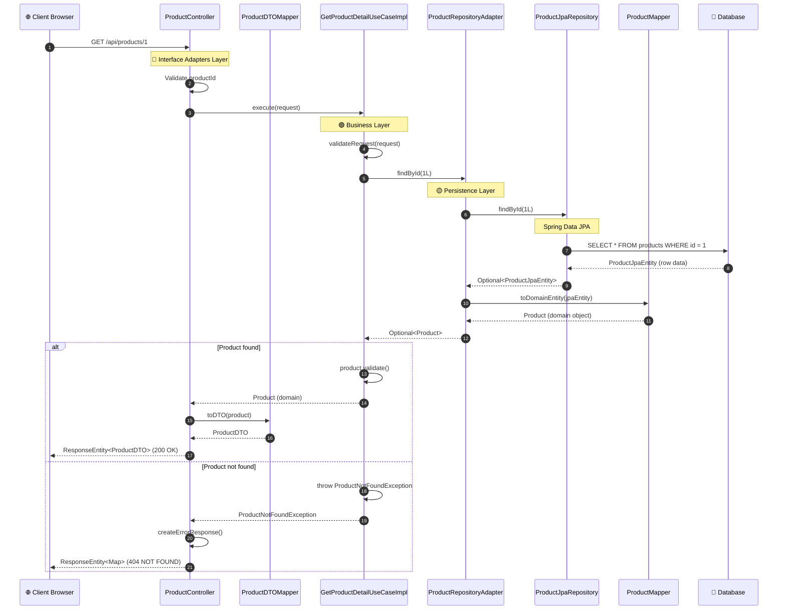

# Use Case 1: Xem Chi Tiết Sản Phẩm - Luồng Hoạt Động Tuần Tự

## 🔄 Sequence Diagram - Request Flow

### **HTTP Request: GET /api/products/1**



---

## 📝 Chi Tiết Từng Bước (Step-by-Step)

### **Bước 1-2: Client Request → ProductController** 🔵
```java
// File: ProductController.java
// Package: com.motorbike.interfaceadapters.controller

@RestController
@RequestMapping("/api/products")
public class ProductController {
    
    private final GetProductDetailUseCase getProductDetailUseCase;
    
    @GetMapping("/{id}")
    public ResponseEntity<?> getProductById(@PathVariable Long id) {
        // 1. Nhận HTTP request từ client
        // 2. Validate input parameters
        if (id == null || id <= 0) {
            return ResponseEntity.badRequest()
                .body(createErrorResponse("Invalid product ID"));
        }
        
        // Chuyển sang bước 3...
    }
}
```
**Nhiệm vụ:**
- Nhận HTTP GET request với `id` từ URL path
- Validate input: kiểm tra `id` có hợp lệ không
- Chuẩn bị gọi Use Case

---

### **Bước 3-4: Controller → Use Case** 🟢
```java
// File: ProductController.java (tiếp)

    @GetMapping("/{id}")
    public ResponseEntity<?> getProductById(@PathVariable Long id) {
        // ...validation code...
        
        try {
            // 3. Tạo request object cho Use Case
            GetProductDetailUseCase.GetProductDetailRequest request = 
                new GetProductDetailUseCase.GetProductDetailRequest(id);
            
            // 4. Gọi Use Case để xử lý business logic
            GetProductDetailUseCase.GetProductDetailResponse response = 
                getProductDetailUseCase.execute(request);
            
            // Chuyển sang bước 17...
        } catch (ProductNotFoundException e) {
            // Handle error...
        }
    }
```
**Nhiệm vụ:**
- Tạo request object chứa productId
- Delegate business logic cho Use Case layer
- Controller KHÔNG biết logic xử lý, chỉ gọi interface

---

### **Bước 5-6: Use Case → Repository** 🟢
```java
// File: GetProductDetailUseCaseImpl.java
// Package: com.motorbike.business.usecase.impl

public class GetProductDetailUseCaseImpl implements GetProductDetailUseCase {
    
    private final ProductRepository productRepository;
    
    @Override
    public GetProductDetailResponse execute(GetProductDetailRequest request) {
        // 5. Validate business rules
        validateRequest(request);
        
        // 6. Gọi Repository để lấy dữ liệu
        Optional<Product> productOpt = 
            productRepository.findById(request.getProductId());
        
        // Check if product exists
        if (productOpt.isEmpty()) {
            throw new ProductNotFoundException(
                "Product not found with id: " + request.getProductId()
            );
        }
        
        // Chuyển sang bước 15...
    }
    
    private void validateRequest(GetProductDetailRequest request) {
        if (request == null || request.getProductId() == null) {
            throw new IllegalArgumentException("Request cannot be null");
        }
        if (request.getProductId() <= 0) {
            throw new IllegalArgumentException("Product ID must be positive");
        }
    }
}
```
**Nhiệm vụ:**
- Validate business rules (productId > 0, not null)
- Gọi Repository interface để lấy Product entity
- Use Case KHÔNG biết database implementation

---

### **Bước 7-8: Repository Adapter → JPA Repository** 🟡
```java
// File: ProductRepositoryAdapter.java
// Package: com.motorbike.persistence.adapter

public class ProductRepositoryAdapter implements ProductRepository {
    
    private final ProductJpaRepository productJpaRepository;
    
    @Override
    public Optional<Product> findById(Long id) {
        // 7. Nhận request từ Business Layer
        // 8. Delegate to Spring Data JPA
        Optional<ProductJpaEntity> jpaEntityOpt = 
            productJpaRepository.findById(id);
        
        // Chuyển sang bước 13...
        return jpaEntityOpt.map(ProductMapper::toDomainEntity);
    }
}
```
**Nhiệm vụ:**
- Implement ProductRepository interface từ Business Layer
- Gọi Spring Data JPA repository để query database
- Chuyển đổi JPA entity sang Domain entity

---

### **Bước 9-10: JPA Repository → Database** 💾
```java
// File: ProductJpaRepository.java
// Package: com.motorbike.persistence.repository

public interface ProductJpaRepository extends JpaRepository<ProductJpaEntity, Long> {
    // Spring Data JPA tự động generate implementation
    // findById(Long id) → inherited from JpaRepository
}
```

**SQL được generate tự động:**
```sql
-- 9-10. Hibernate/JPA executes this query
SELECT 
    p.id, 
    p.name, 
    p.description, 
    p.price, 
    p.image_url, 
    p.specifications, 
    p.category, 
    p.stock_quantity, 
    p.created_at, 
    p.updated_at
FROM products p
WHERE p.id = ?
```

**Nhiệm vụ:**
- Spring Data JPA tự động generate SQL query
- Execute query trên SQL Server database
- Map result set sang ProductJpaEntity object

---

### **Bước 11-12: Database → JPA Entity**
```java
// File: ProductJpaEntity.java
// Package: com.motorbike.persistence.entity

@Entity
@Table(name = "products")
public class ProductJpaEntity {
    @Id
    @GeneratedValue(strategy = GenerationType.IDENTITY)
    private Long id;
    
    private String name;
    private String description;
    
    @Column(precision = 15, scale = 2)
    private BigDecimal price;
    
    private String imageUrl;
    private String specifications;
    private String category;
    private Integer stockQuantity;
    
    // Hibernate maps database row to this object
    // 11-12. Return Optional<ProductJpaEntity>
}
```

**Nhiệm vụ:**
- Hibernate map database row thành ProductJpaEntity object
- Trả về Optional<ProductJpaEntity> cho Repository Adapter

---

### **Bước 13-14: JPA Entity → Domain Entity** 🟡
```java
// File: ProductMapper.java
// Package: com.motorbike.persistence.mapper

public class ProductMapper {
    
    public static Product toDomainEntity(ProductJpaEntity jpaEntity) {
        if (jpaEntity == null) return null;
        
        // 13-14. Convert JPA entity to Domain entity
        return Product.builder()
            .id(jpaEntity.getId())
            .name(jpaEntity.getName())
            .description(jpaEntity.getDescription())
            .price(jpaEntity.getPrice())
            .imageUrl(jpaEntity.getImageUrl())
            .specifications(jpaEntity.getSpecifications())
            .category(jpaEntity.getCategory())
            .stockQuantity(jpaEntity.getStockQuantity())
            .build();
    }
}
```

**Nhiệm vụ:**
- Chuyển đổi từ ProductJpaEntity (Persistence) → Product (Domain)
- Tách biệt database model và business model
- Trả về Domain entity cho Business Layer

---

### **Bước 15-16: Domain Entity Validation** 🟢
```java
// File: GetProductDetailUseCaseImpl.java (tiếp)

    @Override
    public GetProductDetailResponse execute(GetProductDetailRequest request) {
        // ...validation & repository call...
        
        // 15. Get Product from Optional
        Product product = productOpt.get();
        
        // 16. Validate business rules on domain entity
        product.validate();
        
        // Check business constraints
        if (!product.isAvailable()) {
            throw new IllegalStateException("Product is not available");
        }
        
        // Return response with domain entity
        return new GetProductDetailResponse(product);
    }
```

**Product entity business logic:**
```java
// File: Product.java
// Package: com.motorbike.business.entity

public class Product {
    
    public void validate() {
        if (name == null || name.trim().isEmpty()) {
            throw new IllegalArgumentException("Product name cannot be empty");
        }
        if (price == null || price.compareTo(BigDecimal.ZERO) <= 0) {
            throw new IllegalArgumentException("Product price must be positive");
        }
        if (stockQuantity == null || stockQuantity < 0) {
            throw new IllegalArgumentException("Stock quantity cannot be negative");
        }
    }
    
    public boolean isAvailable() {
        return stockQuantity != null && stockQuantity > 0;
    }
}
```

**Nhiệm vụ:**
- Validate business rules trên Domain entity
- Kiểm tra trạng thái sản phẩm (available, has stock)
- Trả về response cho Controller

---

### **Bước 17-18: Controller → DTO Mapper** 🔵
```java
// File: ProductController.java (tiếp)

    @GetMapping("/{id}")
    public ResponseEntity<?> getProductById(@PathVariable Long id) {
        // ...use case execution...
        
        // 17. Nhận Product domain entity từ Use Case
        Product product = response.getProduct();
        
        // 18. Convert Domain entity to DTO for presentation
        ProductDTO productDTO = ProductDTOMapper.toDTO(product);
        
        // Chuyển sang bước 19...
    }
```

**ProductDTOMapper:**
```java
// File: ProductDTOMapper.java
// Package: com.motorbike.interfaceadapters.mapper

public class ProductDTOMapper {
    
    public static ProductDTO toDTO(Product product) {
        if (product == null) return null;
        
        // 18. Map domain fields to DTO fields
        ProductDTO dto = new ProductDTO();
        dto.setId(product.getId());
        dto.setName(product.getName());
        dto.setDescription(product.getDescription());
        dto.setPrice(product.getPrice());
        dto.setImageUrl(product.getImageUrl());
        dto.setSpecifications(product.getSpecifications());
        dto.setCategory(product.getCategory());
        dto.setStockQuantity(product.getStockQuantity());
        dto.setCreatedAt(product.getCreatedAt());
        dto.setUpdatedAt(product.getUpdatedAt());
        
        return dto;
    }
}
```

**Nhiệm vụ:**
- Chuyển đổi Domain entity → DTO (Data Transfer Object)
- DTO là object truyền qua HTTP, không chứa business logic
- Tách biệt internal model và external API contract

---

### **Bước 19-20: HTTP Response to Client** 🔵
```java
// File: ProductController.java (tiếp)

    @GetMapping("/{id}")
    public ResponseEntity<?> getProductById(@PathVariable Long id) {
        // ...use case & dto mapping...
        
        // 19. Wrap DTO in ResponseEntity with HTTP 200 OK
        return ResponseEntity.ok(productDTO);
        
        // 20. Spring Boot automatically serializes to JSON
    }
```

**JSON Response:**
```json
{
  "id": 1,
  "name": "Honda Wave RSX 110",
  "description": "Xe số tiết kiệm nhiên liệu, thiết kế thể thao",
  "price": 23500000,
  "imageUrl": "/images/wave-rsx.jpg",
  "specifications": "Động cơ 110cc, 4 kỳ, làm mát bằng gió",
  "category": "Xe số",
  "stockQuantity": 15,
  "createdAt": "2024-01-01T10:00:00",
  "updatedAt": "2024-01-15T14:30:00"
}
```

**Nhiệm vụ:**
- Trả về HTTP 200 OK với ProductDTO
- Spring Boot tự động serialize DTO thành JSON
- Client nhận response và hiển thị UI

---

## 🎯 Tóm Tắt Luồng (Summary Table)

| Bước | Layer | Class/Component | Trách nhiệm | Input | Output |
|------|-------|----------------|-------------|-------|--------|
| 1-2 | 🔵 Interface Adapters | **ProductController** | Nhận HTTP request, validate input | `GET /api/products/1` | Valid productId |
| 3-4 | 🔵 → 🟢 | **ProductController** | Tạo request, gọi Use Case | `productId = 1` | `GetProductDetailRequest` |
| 5-6 | 🟢 Business | **GetProductDetailUseCaseImpl** | Validate business rules, gọi Repository | `GetProductDetailRequest` | `Optional<Product>` |
| 7-8 | 🟢 → 🟡 | **ProductRepositoryAdapter** | Implement repository, gọi JPA | `Long id = 1` | `Optional<ProductJpaEntity>` |
| 9-10 | 🟡 Persistence | **ProductJpaRepository** | Query database qua Spring Data JPA | SQL query | `Optional<ProductJpaEntity>` |
| 11-12 | 💾 Database | **SQL Server** | Execute query, return row | SQL SELECT | Database row |
| 13-14 | 🟡 Persistence | **ProductMapper** | Convert JPA → Domain entity | `ProductJpaEntity` | `Product` |
| 15-16 | 🟢 Business | **Product** (entity) | Validate domain rules | `Product` | Validated `Product` |
| 17-18 | 🟢 → 🔵 | **ProductDTOMapper** | Convert Domain → DTO | `Product` | `ProductDTO` |
| 19-20 | 🔵 Interface Adapters | **ProductController** | Wrap in HTTP response, serialize JSON | `ProductDTO` | `ResponseEntity<ProductDTO>` |

---

## 🔑 Nguyên Tắc Clean Architecture

### **1. Dependency Rule** (Quy tắc phụ thuộc)
```
Frameworks (🔴)
    ↓ depends on
Interface Adapters (🔵)
    ↓ depends on
Business Layer (🟢) ← implements ← Persistence (🟡)
```
- Dependency luôn chỉ **vào trong** (toward core)
- Business Layer **KHÔNG** phụ thuộc vào Persistence/UI
- Persistence implement interface từ Business Layer

### **2. Separation of Concerns** (Tách biệt trách nhiệm)
- **Controller**: Xử lý HTTP, validation input
- **Use Case**: Business logic, orchestration
- **Repository**: Data access contract
- **Adapter**: Database implementation
- **Mapper**: Chuyển đổi giữa layers

### **3. Interface Segregation** (Tách biệt interface)
- Business Layer định nghĩa `ProductRepository` interface
- Persistence Layer implement `ProductRepositoryAdapter`
- Use Case chỉ biết interface, không biết implementation

### **4. Data Flow** (Luồng dữ liệu)
```
Request → Controller → Use Case → Repository → Database
                                        ↓
Response ← Controller ← Use Case ← Repository ← Database
```

---

## 📊 Layer Responsibilities Breakdown

### 🔵 **Interface Adapters Layer**
- **ProductController**: REST API endpoints, HTTP handling
- **ProductDTO**: Data transfer object cho API
- **ProductDTOMapper**: Convert Domain ↔ DTO

### 🟢 **Business Layer (Core)**
- **Product**: Domain entity với business logic
- **ProductRepository**: Interface định nghĩa data access
- **GetProductDetailUseCase**: Interface cho use case
- **GetProductDetailUseCaseImpl**: Business logic implementation
- **ProductNotFoundException**: Custom exception

### 🟡 **Persistence Layer**
- **ProductJpaEntity**: JPA entity cho database mapping
- **ProductJpaRepository**: Spring Data JPA repository
- **ProductMapper**: Convert JPA ↔ Domain
- **ProductRepositoryAdapter**: Implement repository interface

### 🔴 **Frameworks Layer**
- **ProductConfig**: Spring Bean configuration
- **MainApplication**: Spring Boot entry point

---

## ✅ Kết Luận

Luồng hoạt động tuần tự này thể hiện rõ:
1. **Tách biệt concerns**: Mỗi layer có trách nhiệm riêng
2. **Dependency inversion**: Business không phụ thuộc implementation
3. **Testability**: Mỗi component có thể test độc lập
4. **Maintainability**: Dễ thay đổi database, UI mà không ảnh hưởng business logic
5. **Scalability**: Dễ mở rộng với nhiều use cases khác

🎯 **Clean Architecture giúp code dễ hiểu, dễ test, dễ maintain!**
